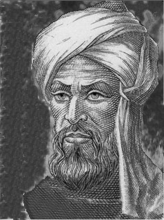

## Un análisis histórico
Los números naturales tienen su origen en una necesidad tan antigua como las primeras civilizaciones, la de contar.

- El hombre primitivo y su percepción.
- __Siglo V a.d.e.__. La caida del _arithmos_.
- __Siglo VI a.d.e.__. Pitagóricos y números racionales.
- __Siglo III a.d.e.__. Euclides y sus tratados.
- __Siglo VI__. Los indios y las cantidades negativas y fracciones.
- __Siglo IX__. Al-Farabi eleva las cantidades irracionales a números. Al-Khwarizmi, padre del Álgebra.
- __Siglo X__. Omar Khayyam y los números irracionales. Al-Uqlidisi y los decimales.
- __Siglo XV__. Al-Kashi y las reglas de los números decimales.
- __Siglo XVI__. Girolamo Cordano y los números negativos. Descartes y las potencias. Christoph Rudolff y el _radix_.
- __Siglo XVII__. John Napier y los logaritmos.
- __Siglo XIX__ La idea de continuidad y la teoría de conjuntos de Cantor, Dedekind, Weierstrass, Heine y Meray.

## Lógica matemática
Hasta casi finales del siglo XIX se pensaba que la validez de una demostración, de un razonamiento matemático, consistía principalmente en que “nos convenciera”, en que se presentara como evidente a nuestra mente y lo aceptáramos como válido. Ésta era, por ejemplo, la forma de entender la argumentación del mismo René Descartes (1596-1650).

Se cita, como ejemplo, la frase del matemático francés Jean Marie Duhamel (1797-1872): “El razonamiento se hace por el sentimiento que nos produce en la mente la evidencia de la verdad, sin necesidad de norma o regla alguna”.

Giuseppe Peano (1858-1932) se levantó contra esta forma de argumentar y, en esencia, defendía que “el valor de una demostración, de un proceso argumentativo, no depende del gusto o sentimientos interiores de nadie, sino de que el argumento tenga una propiedad de validez universalmente comprobable”.

Para Peano la lógica matemática era, realmente, la lógica de la matemática, un instrumento cuyo objetivo era dar el rigor y adecuado valor a las argumentaciones del quehacer de la matemática.

## Introducción al Álgebra
El matemático persa musulmán al-Khwarizmi (se pronuncia castellanizado como al-Juarismi) es considerado el padre del Álgebra, gracias a una de sus obras importantes por su contenido algebraico: __Hisab al-gabr wa’lmuqqabala__, considerada uno de los primeros libros de álgebra.

En las ecuaciones llamaba “cosa” (_xay_ en castellano) a la incógnita, por ello usamos la letra “x” para representarla.

## Expresiones algebraicas
El Álgebra es la rama de las matemáticas que trata a las cantidades de manera general. Las _expresiones algebraicas_ son la combinación de números reales (constantes) y literales o letras (variables) que representan cantidades, mediante operaciones de suma, resta, multiplicación, división, potenciación, etcétera.

#### Ejemplos
$$
4x-2y+6z
$$

Aquí podemos identificar las constantes $4$, $-2$ y $6$ y las variables $x$, $y$ y $z$.

$$
3b^4+5
$$

Donde $3$, $4$ y $5$ son las constantes, aunque cabe mencionar que el $4$ es un _exponente_; mientras solo $b$ es variable.

$$
\sqrt{6t-2u+v}
$$

Tenemos $6$ y $2$ como constantes, además de una que no se expresa de manera explícita: la potencia del _radical_, que en este caso es $\frac{1}{2}$. Las variables son $t$, $u$ y $v$.

### Término algebraico
Es un sumando de una expresión algebraica y representa una cantidad. Es lo que denominamos un monomio y consiste de un coeficiente, una o más bases y uno o más exponentes. 

#### Ejemplos
$$
4x^5
$$

El coeficiente es $4$, la base es $x$ y el exponente es $5$.

$$
- \frac{2}{5} a^2bc^7
$$

El coeficiente es $- \frac{2}{5}$, las bases son $a$, $b$ y $c$; los exponentes son $2$, $1$ y $7$.

$$
3 \sqrt[5]{3y-9}
$$
En este caso, nuestro coeficiente es $3$, la base es $3y-9$ y el exponente es $\frac{1}{9}$.